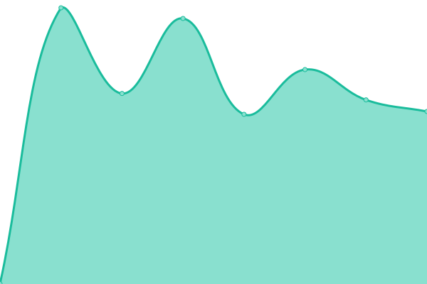
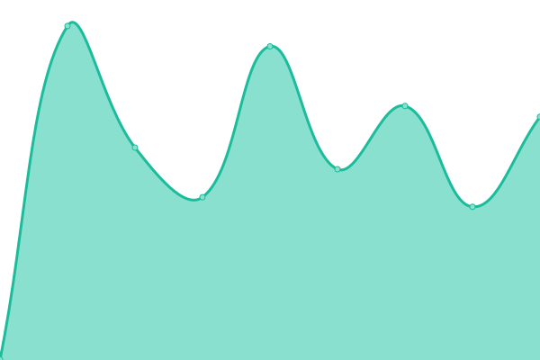

# [📈 Live Status](https://iterate-ch.github.io/upptime/): <!--live status--> **🟧 Partial outage**

This repository contains the open-source uptime monitor and status page for [iterate GmbH](https://iterate.ch), powered by [Upptime](https://iterate-ch.github.io/upptime/).

<!--start: status pages-->
<!-- This summary is generated by Upptime (https://github.com/upptime/upptime) -->
<!-- Do not edit this manually, your changes will be overwritten -->
<!-- prettier-ignore -->
| URL | Status | History | Response Time | Uptime |
| --- | ------ | ------- | ------------- | ------ |
|  [iterate GmbH Website](https://iterate.ch/) | 🟩 Up | [iterate-gmb-h-website.yml](https://github.com/iterate-ch/upptime/commits/HEAD/history/iterate-gmb-h-website.yml) | 

 454ms
     
 | 

<a href="https://iterate-ch.github.io/upptime/history/iterate-gmb-h-website">100.00%</a>
    

|  [iterate GmbH JIRA](https://jira.iterate.ch/) | 🟩 Up | [iterate-gmb-h-jira.yml](https://github.com/iterate-ch/upptime/commits/HEAD/history/iterate-gmb-h-jira.yml) | 

 797ms
     
 | 

<a href="https://iterate-ch.github.io/upptime/history/iterate-gmb-h-jira">100.00%</a>
    

|  [iterate GmbH Bitbucket](https://g.iterate.ch/) | 🟥 Down | [iterate-gmb-h-bitbucket.yml](https://github.com/iterate-ch/upptime/commits/HEAD/history/iterate-gmb-h-bitbucket.yml) | 

 848ms
     
 | 

<a href="https://iterate-ch.github.io/upptime/history/iterate-gmb-h-bitbucket">100.00%</a>
    

|  [Cyberduck Website](https://cyberduck.io/) | 🟩 Up | [cyberduck-website.yml](https://github.com/iterate-ch/upptime/commits/HEAD/history/cyberduck-website.yml) | 

 478ms
     
 | 

<a href="https://iterate-ch.github.io/upptime/history/cyberduck-website">100.00%</a>
    

|  [Cyberduck Update Check](https://version.cyberduck.io/) | 🟩 Up | [cyberduck-update-check.yml](https://github.com/iterate-ch/upptime/commits/HEAD/history/cyberduck-update-check.yml) | 

 793ms
     
 | 

<a href="https://iterate-ch.github.io/upptime/history/cyberduck-update-check">100.00%</a>
    

|  [Cyberduck CLI](https://duck.sh/) | 🟩 Up | [cyberduck-cli.yml](https://github.com/iterate-ch/upptime/commits/HEAD/history/cyberduck-cli.yml) | 

 453ms
     
 | 

<a href="https://iterate-ch.github.io/upptime/history/cyberduck-cli">100.00%</a>
    

|  [Cyberduck Trac](https://trac.cyberduck.io/) | 🟩 Up | [cyberduck-trac.yml](https://github.com/iterate-ch/upptime/commits/HEAD/history/cyberduck-trac.yml) | 

 472ms
     
 | 

<a href="https://iterate-ch.github.io/upptime/history/cyberduck-trac">100.00%</a>
    

|  [Mountain Duck](https://mountainduck.io/) | 🟩 Up | [mountain-duck.yml](https://github.com/iterate-ch/upptime/commits/HEAD/history/mountain-duck.yml) | 

 483ms
     
 | 

<a href="https://iterate-ch.github.io/upptime/history/mountain-duck">100.00%</a>
    

|  [Mountain Duck Update Check](https://version.mountainduck.io/) | 🟩 Up | [mountain-duck-update-check.yml](https://github.com/iterate-ch/upptime/commits/HEAD/history/mountain-duck-update-check.yml) | 

 569ms
     
 | 

<a href="https://iterate-ch.github.io/upptime/history/mountain-duck-update-check">100.00%</a>
    

|  [Mountain Duck Payment Gateway](https://reg.mountainduck.io/payment) | 🟩 Up | [mountain-duck-payment-gateway.yml](https://github.com/iterate-ch/upptime/commits/HEAD/history/mountain-duck-payment-gateway.yml) | 

 923ms
     
 | 

<a href="https://iterate-ch.github.io/upptime/history/mountain-duck-payment-gateway">100.00%</a>
    

|  [Cyberduck Payment Gateway](https://reg.cyberduck.io/payment) | 🟩 Up | [cyberduck-payment-gateway.yml](https://github.com/iterate-ch/upptime/commits/HEAD/history/cyberduck-payment-gateway.yml) | 

 659ms
     
 | 

<a href="https://iterate-ch.github.io/upptime/history/cyberduck-payment-gateway">100.00%</a>
    

<!--end: status pages-->

[**Visit our status website →**](https://iterate-ch.github.io/upptime/)

## 📄 License

- Powered by: [Upptime](https://github.com/upptime/upptime)
- Code: [MIT](./LICENSE) © [Upptime](https://upptime.js.org)
- Data in the `./history` directory: [Open Database License](https://opendatacommons.org/licenses/odbl/1-0/)
